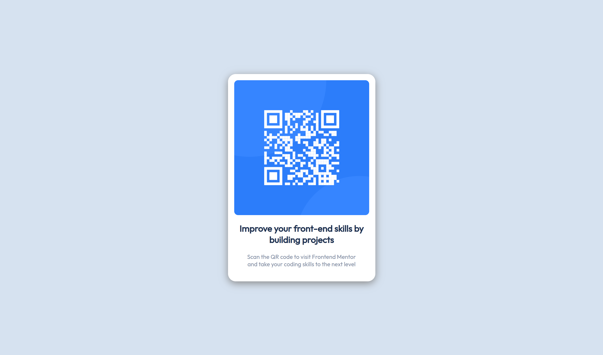

<h1 align='center'>QR code component challenge</h1>

<h3 align='center'>
    <a href='https://www.frontendmentor.io/solutions/qr-code-component-34KXLeYDBX'>Solution</a>
    |
    <a href='https://panayiotistsg.github.io/qr-code-component-frontendmentor/'>Live</a>
    |
    <a href='https://www.frontendmentor.io/challenges/qr-code-component-iux_sIO_H'>Challenge</a>
</h3>

## About

This is a solution to the [QR code component challenge on Frontend Mentor](https://www.frontendmentor.io/challenges/qr-code-component-iux_sIO_H). Frontend Mentor challenges help you improve your coding skills by building realistic projects. 

## Built with

- HTML5
- CSS
- Flexbox